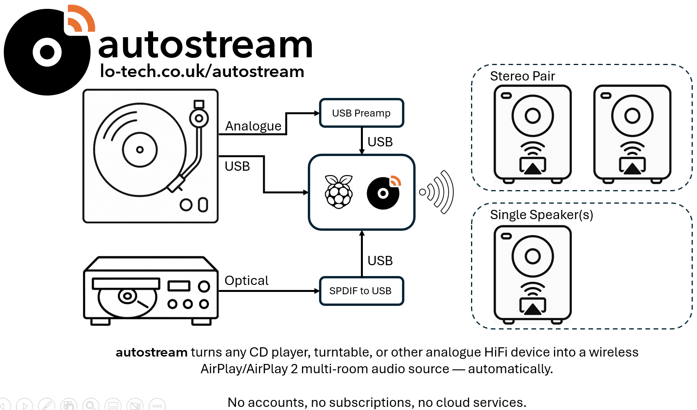
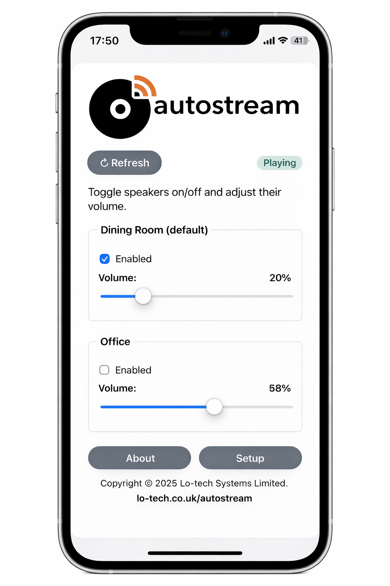

# autostream

**Stream turntables and CD players to AirPlay speakers — automatically.**

**autostream** makes it easy to play vinyl records and CDs through **AirPlay & AirPlay 2** speakers anywhere in your home.
It connects your classic HiFi gear to wireless multi-room speakers, without complex setup or specialist knowledge.

**autostream** exists for people with real Hi-Fi gear who want it to behave like a modern source — without changing how they
listen to music. No apps to install. No complex configuration. Just press play.

> License: Source-available. Free for personal use. Commercial licensing available.

---



---

## What It Does

* **Plays vinyl records and CDs on AirPlay speakers**
* **Provides a simple, iPhone-friendly web app to control volume**
* **Works with phono, line-level, SPDIF and USB audio inputs via low-cost USB dongles**

---

## Perfect For

* Turntables
* CD Players
* Tape Decks and other line-level music sources

Note: **autostream** is designed for music playback and physical media. It is not suitable for video or lip-sync-critical sources such as TVs.

---

## How It Works (High Level)

**autostream** supports one or two connected sources. It listens for audio on one or both, and when sound is detected, it automatically streams it to your AirPlay speakers. When the music stops, the stream stops. And, if you switch from vinyl to CD - **autostream** switches too. Automatically.

Everything runs locally on your network. There are no cloud services, logons, recommendations or end of year wraps. Just you, and your music.

---

## Simple App-Style Interface

**autostream** includes a lightweight web interface designed to feel like a native app on iPhone and iPad. Add it to your home screen for quick access to volume controls and speaker selection.



* Mobile-friendly layout
* PIN-protected setup screen
* No cloud services required

---

## Platform & Requirements

* Raspberry Pi - Pi ZeroW is enough - with an 8GB micro-SD card
* USB audio input device (USB turntable, USB DAC such as the Behringer U-PHONE UFO202, SPDIF to USB dongle such as the Cubilux USB C Optical Audio Capture Adapter)
* AirPlay or AirPlay 2 speakers on the same network

Running on a Pi ZeroW, it consumes less than 2W.

---

## Getting Started

1. Install Git
```sh
sudo apt install git
```
2. Clone the repository:
```sh
git clone https://github.com/lo-tech-systems/autostream.git
```
3. Run the install script:
```sh
cd autostream && sudo ./autostream_install.sh
```
4. Connect one or two audio sources
5. Reboot, then use an iPhone to browse with Safari to http://autostream.local/
6. Run the one-time setup (two screens)

Detailed setup instructions are provided in the docs folder.

From then on, just drop a needle on a record or press play on your CD player - **autostream** will do the rest.
There is no "connect" button. **autostream** simply listens. When music starts, it plays. When it stops, it stops.
And it's designed for continuous operation, dealing intelligently with WiFi outages automatically to ensure it's
always ready - just like your AirPlay speakers.


---

## License

**autostream** is **source-available** and free for **personal, non-commercial use**.

Commercial use, redistribution, or integration into paid products requires a commercial license.

See the `LICENSE` file for full terms.

---

**autostream** is Copyright (c) 2025, **Lo-tech Systems Limited**. All rights reserved.
