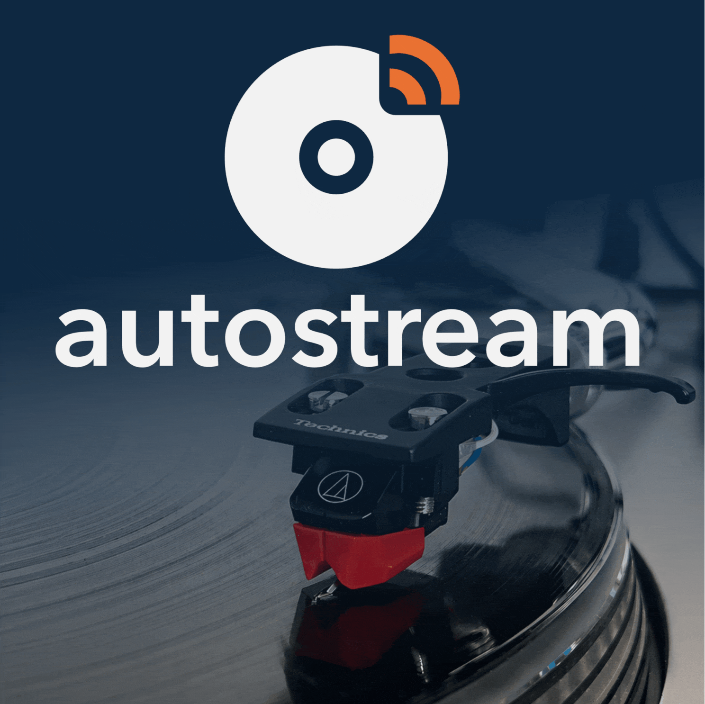

# autostream

**Stream turntables and CD players to AirPlay speakers — automatically.**

**autostream** connects classic Hi-Fi gear to wireless multi-room speakers, making vinyl records and CDs play through AirPlay and AirPlay 2 speakers anywhere in your home. No apps to install. No complex configuration. Just press play.

> License: Source-available. Free for personal use.

One-line install on **Raspberry Pi OS Lite (Trixie, 32-bit)**:
```sh
curl -fsSL https://raw.githubusercontent.com/lo-tech-systems/autostream/main/bootstrap.sh | sudo bash
```

See [GETTING-STARTED.md](docs/GETTING-STARTED.md) for full setup instructions and install options.

---

## Features

* Streams vinyl, CDs, tape decks, and other line-level sources to AirPlay speakers
* Detects audio automatically - starts and stops the stream without any interaction
* Supports HomePods and Stereo Paired HomePods, as well as third-party AirPlay and AirPlay 2 compatible speakers
* iPhone-friendly web app for volume control and speaker selection, with PIN-protected setup
* Runs entirely on your local network - no cloud services, no online accounts, no subscriptions
* Switches between two connected sources automatically (e.g. turntable and CD player)
* 6-band output equaliser and per-input 3-band equaliser
* Stylus, belt, and bearing maintenance tracking for turntable inputs
* Optional track identification — shows artist, title, album, and artwork on the Home screen (powered by Shazam via the autostream-vibra daemon; no API key required)
* Control multiple autostream appliances from a single iOS Home Screen application

---

## Perfect For

* Turntables
* CD Players
* Tape decks and other line-level music sources

---

## How It Works

**autostream** listens on one or two audio inputs. When sound is detected, it streams automatically to your AirPlay speakers. When the music stops, the stream stops. If you switch from vinyl to CD, **autostream** switches too.

Everything runs locally on your network — no cloud services, no online accounts, no recommendations.

---

## Network Access

Autostream is accessed over **HTTP** at `http://<hostname>.local/` (for example, `http://autostream.local/`). **HTTPS is not supported.** Publicly trusted certificates are not available for `.local` hostnames; private HTTPS would require installing and trusting a local certificate authority on every phone or computer, which conflicts with autostream's zero-configuration setup and recovery design. Do not use `https://`.

> Note: the installer and updater download releases and packages over HTTPS from GitHub — this is separate from the local Web UI transport.

---

## Platform & Requirements

* **Raspberry Pi** — Pi Zero W is the minimum; Zero 2W is recommended. 8GB microSD card.
* **OS** — **Raspberry Pi OS Lite (Trixie, 32-bit)**. Both autostream host and dial are tested on 32-bit Trixie; 64-bit is untested.
* **USB audio input**, for example:
  * USB turntable (e.g. Audio-Technica AT-LP60XUSBGM)
  * USB ADC for line-level or phono input (e.g. Behringer U-PHONE UFO202)
  * Optical audio adapter for CD players (e.g. Cubilux USB C Optical Audio Capture Adapter)
* **AirPlay or AirPlay 2 speakers** on the same network

Power consumption on a Pi Zero W or Zero 2W: under 2 Watts.

**autostream** automatically installs OwnTone for speaker discovery and streaming.

---

## Getting Started

1. Flash **Raspberry Pi OS Lite (Trixie, 32-bit)** using Raspberry Pi Imager, boot, and SSH in.
2. Run the one-line installer above.
3. Connect one or two audio sources.
4. Reboot, then open Safari on iPhone and browse to `http://autostream.local/` (replace `autostream` with your Pi's hostname if you changed it).
5. Complete the one-time setup — it takes two screens.

From there, just drop the needle or press play. **autostream** will do the rest.

See [GETTING-STARTED.md](docs/GETTING-STARTED.md) for detailed setup instructions.

---

## License

**autostream** is **source-available** and free for **personal, non-commercial use**.

See the `LICENSE` file for full terms.

---

**autostream** is Copyright (c) 2025–2026, **Lo-tech Systems Limited**. All rights reserved.
