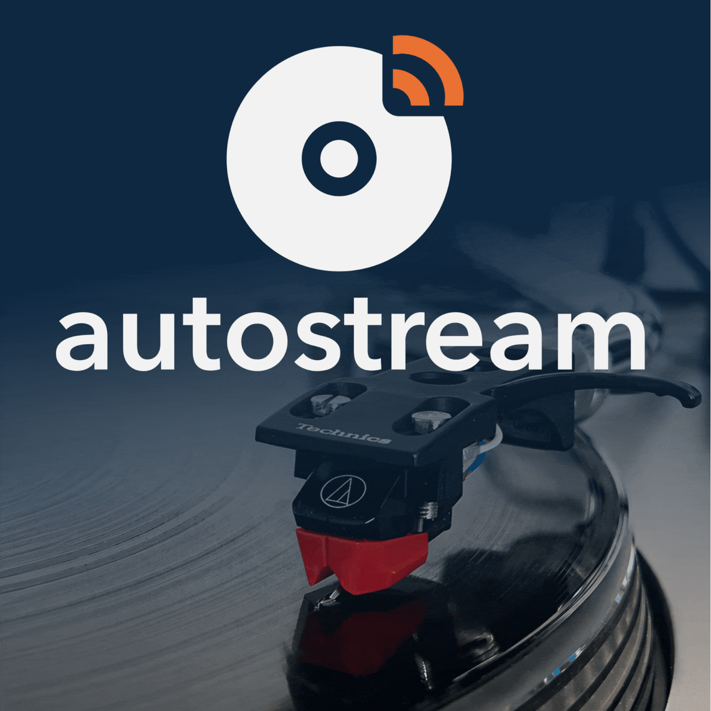

# autostream

**Stream turntables and CD players to HomePods, Apple TV, and AirPlay speakers automatically.**

**autostream** connects classic Hi-Fi gear to wireless multi-room speakers, making analogue sources first-class citizens in your AirPlay world. No apps to install and no complex configuration: Just press play.

> autostream works with HomeOS 27 and tvOS 27.

**autostream** is designed to be invisible - it converts a cheap Raspberry Pi into a tiny always-on audio streaming appliance with no clutter, and is easy to install with only one command needed.

See [GETTING-STARTED.md](docs/GETTING-STARTED.md) for full setup instructions and install options, and the [documentation index](docs/README.md) for all the user guides.



---

## Key Features

* Streams vinyl, CDs, tape decks, and other line-level sources to AirPlay speakers
* Plays to:
  * HomePods and Stereo Paired HomePods (including HomeOS 27)
  * Apple TV (with HDMI in stereo or 5.1 upmix, or with HomePods in stereo)
  * Third-party AirPlay and AirPlay 2 compatible speakers (Sonos, Denon, Edifier and more)
* Detects audio automatically - starts and stops the stream without any interaction
* Connects to your turntable or CD player with a simple USB audio adapter
* Also works with Bluetooth-equipped turntables (no USB audio adapter needed)

## Additional Features

* iPhone-friendly web app for volume control and speaker selection, with PIN-protected setup
* Optional track identification - shows artist, title, album, and artwork on the Home screen
* Switches between two connected sources automatically (e.g. turntable and CD player)
* Repeat mode plays the last record or CD or repeat
* 6-band output equaliser and per-input 3-band equaliser
* Stylus, belt, and bearing maintenance tracking for turntable inputs
* Multi-appliance aware - deploy multiple **autostream** appliances in your home and control them all together, either using the web app or the **autostream dial**
* Can be used as a stand-alone appliance or embedded into your audio gear.

**autostream** runs entirely on your local network and needs no cloud services, no online accounts, or subscriptions (the optional track identification feature does use Shazam cloud with no API key being required).

## autostream dial

**autostream dial** provides a physical control for all of your **autostream** appliances. It can be deployed in two ways:

1. With a simple rotary encoder to provide a physical volume control for all speakers
2. With a touch screen (with or without the encoder) to show album artwork and provide a simple interface to control volume and replay repeat recordings available on any of your **autostream** appliances   

**autostream dial** is currently under development with a preview available today. **autostream 0.7.0** - coming soon - will bring full functionality.

---

## Network Access

**autostream** is accessed over **HTTP** at `http://<hostname>.local/` (for example, `http://autostream.local/`).

> Note: Publicly trusted certificates are not available for `.local` hostnames so implementing HTTPS would require installing certificates on every phone or computer with might access **autostream**, which conflicts with it's zero-configuration setup and recovery design.

> Note: the installer and updater download releases and packages over HTTPS from GitHub - this is separate from the local Web UI transport.

---

## Platform & Requirements

* **Raspberry Pi** - Pi Zero 2W minimum for autostream; Zero W minimum for dial. 8GB+ microSD card.
* **OS** - **Raspberry Pi OS Lite (Trixie)**. Use 64-bit for autostream, unless deploying on Pi Zero W.
* **USB audio input**, for example:
  * USB turntable (e.g. Audio-Technica AT-LP60XUSBGM)
  * USB ADC for line-level or phono input (e.g. Behringer U-PHONE UFO202)
  * Optical audio adapter for CD players (e.g. Cubilux USB C Optical Audio Capture Adapter)
* **AirPlay or AirPlay 2 speakers** on the same network

Power consumption on a Pi Zero W or Zero 2W: under 2 Watts.

**autostream** automatically installs owntone-mini (a derivative of OwnTone) for speaker discovery and streaming.

---

## Getting Started (autostream)

1. Flash **Raspberry Pi OS Lite (Trixie)** using Raspberry Pi Imager (remember to configure the WiFi in the tool), insert the microSD card into the Pi and boot up, then SSH in.
2. Run the one-line installer:

```sh
curl -fsSL https://raw.githubusercontent.com/lo-tech-systems/autostream/main/bootstrap.sh | sudo bash
```

3. Connect one or two audio sources.
4. Reboot, then open Safari on iPhone and browse to `http://autostream.local/` (replace `autostream` with your Pi's hostname if you changed it).
5. Complete the one-time setup - it takes two screens.

From there, just drop the needle or press play. **autostream** will do the rest.

See [GETTING-STARTED.md](docs/GETTING-STARTED.md) for detailed setup instructions.

---

## Getting Started (autostream dial)

Dial runs on it's own Raspberry Pi - it can't share with autostream.

1. Deploy an **autostream** appliance first (see above).
2. Flash **Raspberry Pi OS Lite (Trixie)** using Raspberry Pi Imager (remember to configure the WiFi in the tool), insert the microSD card into the Pi and boot up, then SSH in.
3. Run the dial one-line installer:

```sh
curl -fsSL https://raw.githubusercontent.com/lo-tech-systems/autostream/main/dial_bootstrap.sh | sudo bash
```

4. Reboot, then continue setup from the **autostream** web app on your phone (Setup → Dials)

See [Getting Started](docs/dial/GETTING-STARTED.md) for detailed setup instructions and [BUILD-GUIDE.md](docs/dial/BUILD-GUIDE.md) for hardware build instructions.

---

## Developer Documentation

* [Adding a playback backend](docs/ADDING-AUDIO-BACKEND.md)
* [Adding a track-identification provider](docs/ADDING-TRACK-ID-PROVIDER.md)

---

## License

**autostream** is **source-available** and free for **personal, non-commercial use**.

See the `LICENSE` file for full terms.

---

**autostream** is Copyright (c) 2025-2026, **Lo-tech Systems Limited**. All rights reserved.
