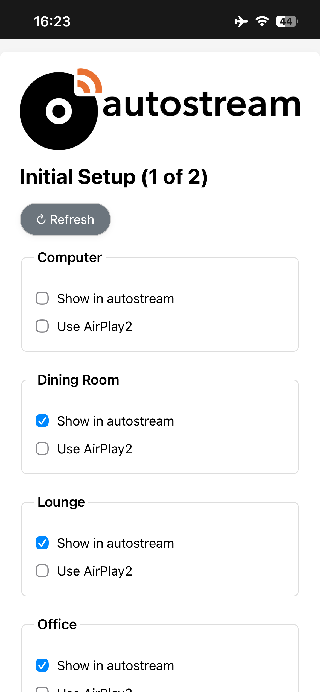
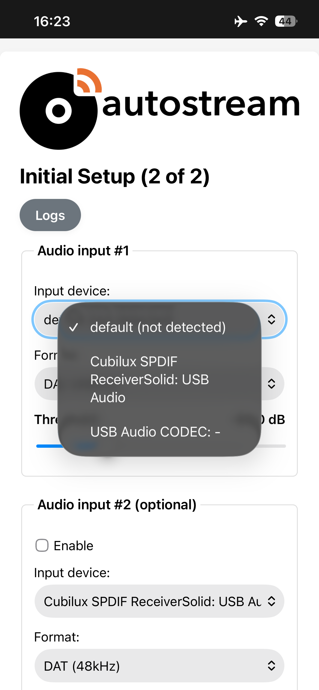
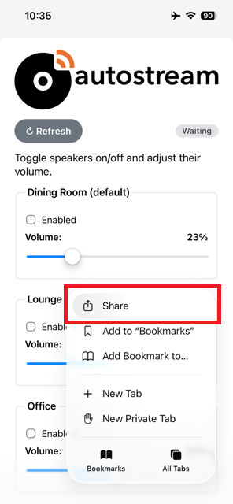
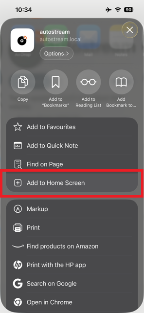
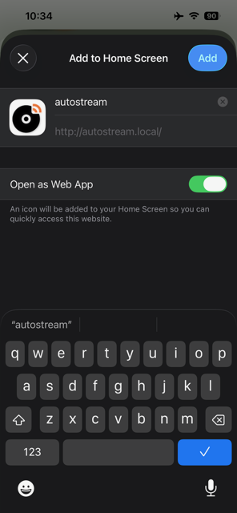

# Getting Started

After installation, **autostream** only requires a short, one-time setup using an iPhone or iPad.

## Initial Setup

1. Run the installer (see README.md)

2. After installation, connect your input devices (turntable, SPDIF dongle, USB preamp, etc.) and then reboot the system.

3. Using **Safari** on your iPhone or iPad, navigate to:

   ```
   http://autostream.local/
   ```

4. The system will prompt for your PIN and will then guide you through two simple setup pages.

---

### Setup Page 1 — Speaker Selection

On the first setup page, all available **AirPlay / AirPlay 2** speakers on your network should appear.

* Deselect any speakers you do not want to be available in this autostream appliance.
* Tap **Continue** when finished.

If your speakers do not appear:

* Ensure they are powered on
* Tap **Refresh** to rescan the network



---

### Setup Page 2 — Input & Defaults

On the second setup page:

1. Choose your connected **input device** from the list.
2. If you have a second input connected, enable it and select that device as well.



Next, choose:

* **Default speakers**
* **Default volume level**

When the system has been idle for some time, these default speakers will automatically start playing when music is detected. Any other previously selected speakers will be muted.

Tap **Done** to complete setup.
The system will then show the autostream **Home Screen**

---

## Home Screen Web App Mode

autostream is designed to be used from your device’s home screen for an easy, app-like experience.

### Add autostream to the Home Screen

1. Open autostream in **Safari**
2. Tap the **Share** button at the bottom of the screen



3. Swipe up and select **Add to Home Screen**




Once added, autostream behaves like a regular app — providing quick access to volume controls and speaker selection without opening Safari manually.
