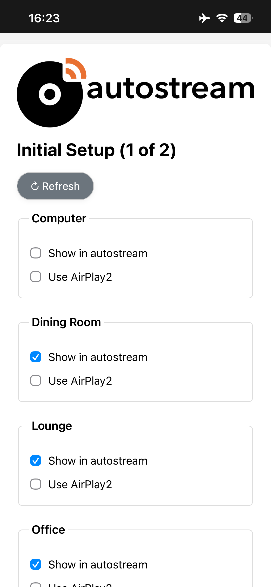
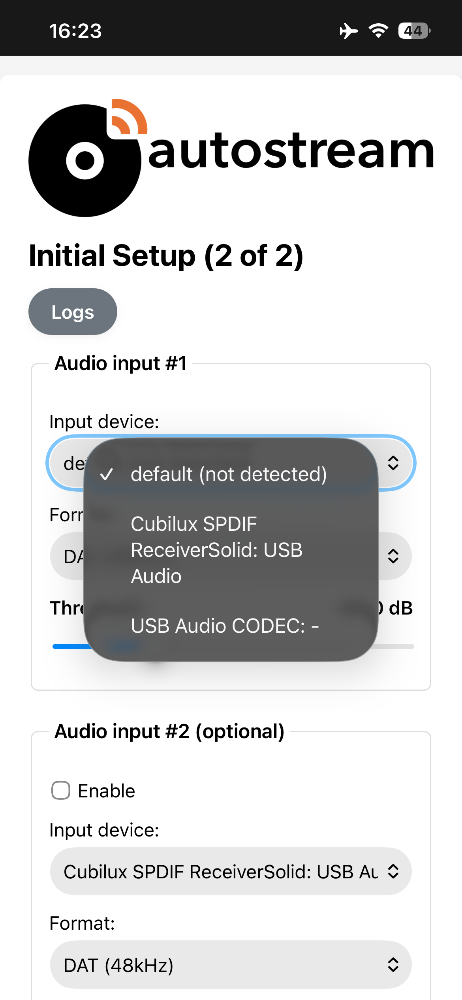
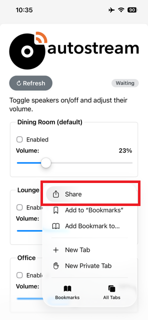
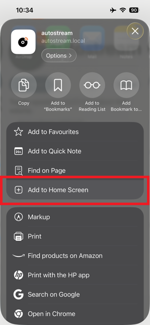
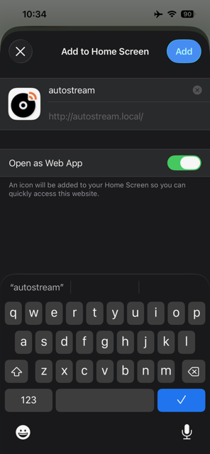

# Getting Started

## Installation

Run the installer on a Raspberry Pi running **Raspberry Pi OS Lite (Trixie, 32-bit)**. Both the autostream host and dial are tested on 32-bit Trixie; 64-bit is untested.

```sh
curl -fsSL https://raw.githubusercontent.com/lo-tech-systems/autostream/main/bootstrap.sh | sudo bash
```

This downloads the latest stable release and installs everything autostream needs, including OwnTone for speaker discovery and streaming.

### OwnTone Install Options

By default, the installer builds **owntone-mini** from source. This is a lightweight build maintained by Lo-tech Systems, optimised for the Pi Zero and low-power devices.

If you prefer to use the standard packaged OwnTone build instead, pass `--owntone=full`:

```sh
curl -fsSL https://raw.githubusercontent.com/lo-tech-systems/autostream/main/bootstrap.sh | sudo bash -s -- --owntone=full
```

Use `--owntone=full` if you need support for protocols other than AirPlay. Otherwise, the default `owntone-mini` build is recommended.

---

## Initial Setup

After installation, **autostream** only requires a short, one-time setup using an iPhone or iPad.

1. Connect your audio sources (turntable, CD player, etc.) and reboot the Pi.

2. Using **Safari** on your iPhone or iPad, navigate to:

   ```
   http://autostream.local/
   ```

   Replace `autostream` with your Pi's hostname if you changed it during setup.

3. The system will prompt for your PIN and will then guide you through two simple setup pages.

---

### Setup Page 1 — Speaker Selection

On the first setup page, all available **AirPlay / AirPlay 2** speakers on your network should appear.

* Deselect any speakers you do not want to be available in this autostream appliance.
* Tap **Continue** when finished.

If your speakers do not appear:

* Ensure they are powered on
* Tap **Refresh** to rescan the network



---

### Setup Page 2 — Input & Defaults

On the second setup page:

1. Choose your connected **input device** from the list.
2. If you have a second input connected, enable it and select that device as well.



Next, choose:

* **Default speakers**
* **Default volume level**

When the system has been idle for some time, these default speakers will automatically start playing when music is detected. Any other previously selected speakers will be muted.

Tap **Done** to complete setup.
The system will then show the autostream **Home Screen**.

---

## Home Screen Web App Mode

autostream is designed to be used from your device's home screen for an easy, app-like experience.

### Add autostream to the Home Screen

1. Open autostream in **Safari**
2. Tap the **Share** button at the bottom of the screen



3. Swipe up and select **Add to Home Screen**




Once added, autostream behaves like a regular app — providing quick access to volume controls and speaker selection without opening Safari manually.
