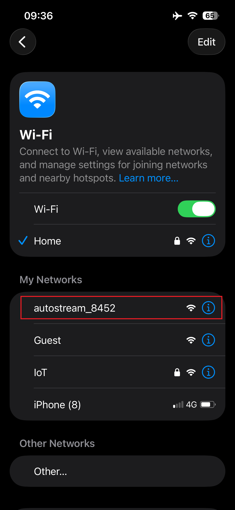

# TROUBLESHOOTING.md

## Troubleshooting

### Before you start

**autostream** is designed to be reached over your home network at:

* `http://<hostname>.local/` (example: `http://autostream.local/`)

If `.local` names don’t work on your network/device, try the device IP address instead (see **Advanced → Finding the IP**).

---

### Same Wi-Fi network

For discovery/control to work reliably, your phone/tablet, the **autostream** Raspberry Pi, and your AirPlay speakers must be on the **same LAN/Wi-Fi**.

Check these common issues:

* **Guest Wi-Fi / “Guest network”**: often blocks device-to-device traffic (client isolation).
* **“AP isolation” / “Client isolation”** enabled on your router/AP: prevents devices from talking to each other.
* **VLANs / multiple SSIDs**: your phone might be on one network while speakers are on another.
* **Extenders / mesh nodes** with isolation settings: can block multicast/broadcast.

What to try next:

1. Put your phone/tablet on your **main** Wi-Fi (not guest).
2. Confirm your AirPlay speaker is also on that same Wi-Fi.
3. Try loading:

   ```text
   http://autostream.local/
   ```
4. If it still doesn’t load, try from another device (a laptop on the same Wi-Fi) to rule out a phone/browser issue.

---

### Forgotten PIN

If you’ve forgotten your PIN, you can reset it by editing the file stored on the device’s micro-SD card.

1. Power down the Raspberry Pi, remove the micro-SD card, and insert it into a Windows PC (using an SD adapter if needed).
2. Open the boot/config partition that appears in File Explorer, locate PIN.TXT, and update its contents to your new PIN (overwrite the existing value).
3. Save the file and safely eject the micro-SD card.
4. Reinsert it into the Raspberry Pi, and power it back on.

Once **autostream** starts, you should be able to authenticate using the updated PIN.

---

### Raspberry Pi power problems

**autostream** includes a Raspberry Pi power health check (it reads the Pi’s “throttled/undervoltage” status). Power issues can look like software/network bugs.

Symptoms that strongly suggest under-power:

* Random reboots
* Wi-Fi dropouts / network disappearing
* Audio glitches or “stuttering”
* SD card corruption / sudden boot failures after a power event

What to try next:

* Use a known-good Raspberry Pi PSU (or an equivalent, high-quality supply for your specific Pi model. Note that 'an expensive USB adapter' it not necessarily suitable, especially if you are using a Pi4 or Pi5).
* Avoid powering from a TV USB port or low-power hub.
* If you can reach the UI, check for any **power warning banner** (**autostream**’s code exposes messages like “Under-voltage detected…” via `core/autostream_rpi.py`).

---

### Multiple devices

If you have more than one **autostream** on the same network, you should give each device a **unique hostname**.

Why this matters:

* The default access pattern is `http://<hostname>.local/`.
* Duplicate hostnames can cause “sometimes it loads, sometimes it doesn’t”, or you might reach the wrong unit.

#### To Change the Device Name (hostname) 

Go into the Setup page and enter a new hostname. This can also be set during the intial system setup. Either way, you'll need the PIN.

Choose a unique hostname for each unit, e.g.:

   * `autostream-lounge`
   * `cd-player`
   * `lounge-hifi`

After changing it, confirm the active name:

* From the UI URL you use:

  ```text
  http://<new-hostname>.local/
  ```
* Or via SSH (if you have it enabled) (see **Advanced → SSH/login**):

  ```bash
  hostname
  cat /etc/hostname
  ```

> Note: **autostream** also makes a best-effort attempt to refresh mDNS announcements for hostname changes. Depending on your network, it may still take a short while for `.local` discovery to update.


---

### Changed Wi-Fi SSID or password

**autostream** stores the “configured SSID” marker at:

* `/opt/autostream/ssid` (see `core/autostream_wifi_watcher.py`)

If your Wi-Fi name or password changes, the device may no longer be able to connect. **autostream**’s Wi-Fi watcher will attempt recovery by entering **AP mode** under specific conditions.

#### What AP / hotspot mode looks like



**autostream**’s AP mode:

* Starts if Wi-Fi is **unconfigured** or still **offline after ~60 seconds** after boot
* Runs for **up to 15 minutes**
* Is **suppressed if wired Ethernet is connected**
* Uses an SSID derived from the Wi-Fi MAC address:
  * `autostream_XXXX` (last 4 hex digits), or fallback `autostream_SETUP`
* Uses a local AP IP of:
  * `192.168.4.1/24`

#### Recovery steps (re-provision Wi-Fi)

1. **Reboot** the **autostream** device.
2. Wait ~2 minutes.
3. On your phone/tablet, look for a Wi-Fi network named like:

   * `autostream_3A7F` (example)
4. Connect to that hotspot.
5. The **autostream** WiFi setup wizard should open automatically. If it doesn't, disconnect
and 'forget' the network, and try again. As last resource, navigate using Safari to:
     ```text
     http://autostream.local/setup
     ```
6. Select your home Wi-Fi SSID from the list and enter it's password.
7. Wait for the device to rejoin your home Wi-Fi, then reconnect your phone back to your home Wi-Fi and load via Safari:

   ```text
   http://<hostname>.local/
   ```

If you miss the AP window:

* AP mode is only available **once per boot** for ~15 minutes.
* Power-cycle/reboot and try again.

---

### If nothing works (quick checklist)

Run through this in order:

1. **Reboot order**

   * Reboot **autostream**
   * Reboot your Wi-Fi router/AP (only if you suspect router issues)
   * Power-cycle the AirPlay speaker(s)
2. **Same network**

   * Phone/tablet + **autostream** + speakers on the same SSID (not guest)
3. **Try both URLs**

   * `http://autostream.local/`
   * `http://<device-ip>/` (see Advanced)
4. **Power**

   * Swap to a known-good Raspberry Pi PSU
5. **Service health**

   * If you can SSH, check `autostream.service` (see Advanced)

---

## Advanced

### Downloading logs

There are two ways to access the autostream logs:

1. **Offline “problem” page → Download Logs (ZIP)**

   * If **autostream**’s main UI is down, the nginx “offline” page includes a **Download Logs** button that hits:

     * `/offline/download-logs`
   * This runs `assets/cgi/download-logs.cgi` (via nginx + `fcgiwrap`) and returns a ZIP created from:

     * `/var/log/autostream/*.log`

2. **Logs page → Download (single log file)**

   * The main UI has a Logs page that can download the configured log file via:

     * `/api/log_file`
   * The file path comes from config (`general.log_file`) parsed by `core/autostream_config.py`.

Browser note (important):

* The “Download Log Bundle” is accessible from Safari or a PC - it will not show in “standalone/PWA” mode.
* If downloads don’t work in your current browser, try a different one. **Safari on macOS** or a **Windows browser** is a known workaround.

Where logs live on disk:

* `/var/log/autostream/autostream.log` (common main log file path in this repo)
* `/var/log/autostream/wifi_setup.log` (Wi-Fi/AP mode state machine)
* `/var/log/autostream/update.log` (updater)
* `/var/log/autostream/autostream_rebooter.log` (rebooter service)

---

### SSH/login and service checks

This repo includes systemd units intended to run from an install location like `/opt/autostream` (see `system/systemd/*.service`). Whether SSH is enabled depends on your OS image/install (not defined in this repo), but if you can SSH in, these checks are the fastest way to diagnose issues.

#### Find the IP (if `.local` doesn’t work)

On your router:

* Look for a DHCP client named `autostream` or your custom hostname.

Over SSH:

```bash
hostname
ip addr
ip route
```

#### Check services (systemd)

Main service unit name from the repo:

* `autostream.service` (see `system/systemd/autostream.service`)

Useful commands:

```bash
systemctl status autostream.service
journalctl -u autostream.service --no-pager -n 200
sudo systemctl restart autostream.service
```

Wi-Fi/AP mode service:

* `autostream_wifi_watcher.service` (see `system/systemd/autostream_wifi_watcher.service`)

```bash
systemctl status autostream_wifi_watcher.service
journalctl -u autostream_wifi_watcher.service --no-pager -n 200
sudo systemctl restart autostream_wifi_watcher.service
```

DNS/DHCP helper for AP mode (used during hotspot setup):

* `autostream_dnsmasq.service` (see `system/systemd/autostream_dnsmasq.service` and `system/dnsmasq/autostream-setup.conf`)

```bash
systemctl status autostream_dnsmasq.service
journalctl -u autostream_dnsmasq.service --no-pager -n 200
sudo systemctl restart autostream_dnsmasq.service
```

Other repo-provided units you may see enabled (depending on install):

* `autostream_rebooter.service` / `.path`
* `autostream_sdcardhealth.service` + `.timer`
* (see `system/systemd/`)

---

### Validate configuration

The main service launches:

* `autostream_webui.py` with:

  * `/opt/autostream/autostream.ini`
  * (from `ExecStart=` in `system/systemd/autostream.service`)

So the first thing to verify is that the config exists and is readable:

```bash
ls -l /opt/autostream/autostream.ini
```

If the UI is up but behavior is wrong, inspect `autostream.ini` and compare against what the code expects in:

* `core/autostream_config.py` (parsing + defaults)
* Any “setup”/settings handlers in:

  * `core/autostream_webui_pages.py`
  * `core/autostream_wifi_watcher.py` (hostname + Wi-Fi provisioning)

Hostname (device name) check:

```bash
cat /etc/hostname
hostname
```

Wi-Fi “configured SSID marker” check (used to decide whether to enter AP mode):

```bash
ls -l /opt/autostream/ssid
cat /opt/autostream/ssid
```

> If you suspect the Wi-Fi configuration state is “stuck”, the most reliable recovery path supported by the code is still: **reboot → join the `autostream_XXXX` hotspot → re-provision at `/setup`**.
