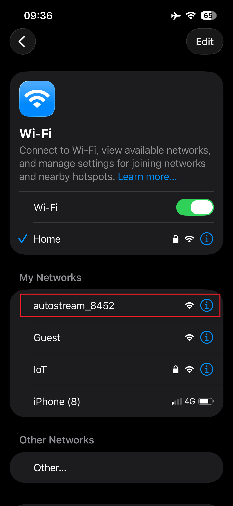

# TROUBLESHOOTING.md

## Troubleshooting

### Before you start

**autostream** is designed to be reached over your home network at:

* `http://<hostname>.local/` (example: `http://autostream.local/`)

**Use HTTP, not HTTPS.** Autostream does not support HTTPS — publicly trusted certificates are not available for `.local` hostnames. If your browser redirects `http://` to `https://` automatically, disable that redirect for this address or use a different browser.

If `.local` names don’t work on your network/device, try the device IP address instead (see **Advanced → Finding the IP**).

---

### Same Wi-Fi network

For discovery/control to work reliably, your phone/tablet, the **autostream** Raspberry Pi, and your AirPlay speakers must be on the **same LAN/Wi-Fi**.

Check these common issues:

* **Guest Wi-Fi / “Guest network”**: often blocks device-to-device traffic (client isolation).
* **“AP isolation” / “Client isolation”** enabled on your router/AP: prevents devices from talking to each other.
* **VLANs / multiple SSIDs**: your phone might be on one network while speakers are on another.
* **Extenders / mesh nodes** with isolation settings: can block multicast/broadcast.

What to try next:

1. Put your phone/tablet on your **main** Wi-Fi (not guest).
2. Confirm your AirPlay speaker is also on that same Wi-Fi.
3. Try loading:

   ```text
   http://autostream.local/
   ```
4. If it still doesn’t load, try from another device (a laptop on the same Wi-Fi) to rule out a phone/browser issue.

---

### Forgotten PIN

Factory Reset is PIN-protected, so the first question is whether you can still get into the Setup screen.

Important PIN behavior:

* If you have **not** set your own PIN, the appliance uses the "factory PIN" (set at initial install) from `/boot/firmware/pin.txt`.
* If you **have** set your own PIN, it is stored in `/var/lib/autostream/autostream-state.json`.
* When a user PIN exists, the Setup PIN prompt will accept either:
  * the user PIN, or
  * the factory PIN from `/boot/firmware/pin.txt`, but only for the first 30 minutes after boot
* After the appliance has been up for more than 30 minutes, the user PIN is required.

What to try:

1. If the appliance was booted recently, try the factory PIN first.
2. If it has been running for a while, power-cycle it and try the factory PIN again within 30 minutes.
3. If you can get into Setup, you can either change the PIN or use Factory Reset.

If you still cannot authenticate, use the offline recovery method below.

1. Power down the Raspberry Pi, remove the micro-SD card, and insert it into a Windows PC (using an SD adapter if needed).
2. Open the boot/config partition that appears in File Explorer, locate `pin.txt`, and update its contents to your new PIN.
3. Save the file and safely eject the micro-SD card.
4. Reinsert it into the Raspberry Pi, power it back on, and authenticate within 30 minutes of boot using that factory PIN.

Once you are back in Setup, either:

* change the user PIN, or
* use Factory Reset if you want to return the appliance to first-run setup

---

### Authentication and PIN security

The PIN protects setup settings: speaker selection, input configuration, hostname, Wi-Fi, EQ, factory reset, and PIN change. **Volume control is not PIN-protected** — the dial and the Web UI volume slider always work without a PIN.

**How the nonce mechanism works:**

Each time a browser opens the setup page, autostream issues a short-lived challenge (nonce). The browser hashes the PIN with the nonce and sends only the hash, not the PIN. This means a passive observer cannot directly read the PIN from a captured request.

**Limitations — what the nonce mechanism does not prevent:**

- **Offline PIN guessing.** A captured nonce/hash pair can be replayed locally to guess the PIN by brute force. Short or simple PINs are more vulnerable; use a longer, less predictable PIN on untrusted networks.
- **Session cookie capture.** After authentication, autostream issues an HTTP session cookie. A passive observer who captures that cookie can replay it to access settings without knowing the PIN.
- **Active attacks (man-in-the-middle).** An attacker with full network access can intercept or modify traffic. The nonce mechanism provides no protection against active MITM.
- **Response confidentiality.** Response data is not encrypted.

The nonce mechanism is appropriate for a trusted home network. It is not a substitute for HTTPS.

---

### Resetting autostream

If the UI still works but the appliance is misconfigured, the quickest recovery path is usually **Factory Reset** from the Setup screen.

Factory Reset:

* is PIN-protected
* erases settings
* returns the appliance to first-run Wi-Fi setup mode

Use Factory Reset when:

* setup choices need to be redone from scratch
* speaker or input configuration is badly wrong
* Wi-Fi setup feels stuck and you want a clean restart
* the appliance is behaving oddly after a configuration change

Factory Reset is a settings reset, not a full software reinstall. If an update has failed badly or the software installation itself is damaged, use the reinstall path instead.

---

### Update problems

In-app updates can take a long time. A full update may take up to **15 minutes**, because it can also:

* run an APT system update
* rebuild `autostream_monitor`
* rebuild `owntone-mini`
* recreate the Python virtual environment

Micro-SD card speed has a big impact, so slower cards can make updates feel stalled even when they are still working.

What to do:

1. Let the update run for at least 15 minutes before assuming it has failed.
2. Do not remove power while the update is in progress.
3. If the appliance reboots into an update/offline page, leave it alone and let the retry path finish.
4. If the UI does not come back after a long wait, power-cycle the appliance once.

When upgrading from releases earlier than `0.2`, [Reinstalling from the console](#reinstalling-from-the-console) is preferred.

The supported recovery path is:

1. use the uninstall script as a best-effort cleanup
2. run the installer again from the console

For a fully predictable clean slate, re-image the SD card instead.

See [UNINSTALL.md](UNINSTALL.md) for the uninstall script details.

---

### Distorted or clipped audio after EQ changes

Equaliser boosts and gain changes can cause clipping.

If the sound becomes harsh, crunchy, or obviously distorted after audio tuning:

1. reduce output gain
2. enable auto-trim
3. replay a loud track and let the trim settle
4. set manual output gain based on the trim value that was needed
5. reset the current trim, then leave auto-trim enabled as protection against future peaks

For the full workflow, see [AUDIO-TUNING.md](AUDIO-TUNING.md).

---

### Reinstalling from the console

If Factory Reset is not enough, or if an update has left the appliance in a bad state, recover from the console instead.

Recommended order:

1. Run the best-effort uninstall script:

   ```bash
   sudo ./autostream_uninstall.sh
   ```

2. Reboot, then run the installer again:

   ```bash
   curl -fsSL https://raw.githubusercontent.com/lo-tech-systems/autostream/main/bootstrap.sh | sudo bash
   ```

3. If you want the cleanest possible result, re-image the micro-SD card instead of relying on uninstall.

See [UNINSTALL.md](UNINSTALL.md) for details and limitations of the uninstall script.

---

### Raspberry Pi power problems

**autostream** includes a Raspberry Pi power health check (it reads the Pi’s “throttled/undervoltage” status). Power issues can look like software/network bugs.

Symptoms that strongly suggest under-power:

* Random reboots
* Wi-Fi dropouts / network disappearing
* Audio glitches or “stuttering”
* SD card corruption / sudden boot failures after a power event

What to try next:

* Use a known-good Raspberry Pi PSU (or an equivalent, high-quality supply for your specific Pi model. Note that 'an expensive USB adapter' it not necessarily suitable, especially if you are using a Pi4 or Pi5).
* Avoid powering from a TV USB port or low-power hub.
* If you can reach the UI, check for any **power warning banner** (**autostream**’s code exposes messages like “Under-voltage detected…” via `core/autostream_rpi.py`).

---

### Multiple devices

If you have more than one **autostream** on the same network, you should give each device a **unique hostname**.

Why this matters:

* The default access pattern is `http://<hostname>.local/`.
* Duplicate hostnames can cause “sometimes it loads, sometimes it doesn’t”, or you might reach the wrong unit.

#### To Change the Device Name (hostname) 

Go into the Setup page and enter a new hostname. This can also be set during the intial system setup. Either way, you'll need the PIN.

Choose a unique hostname for each unit, e.g.:

   * `autostream-lounge`
   * `cd-player`
   * `lounge-hifi`

After changing it, confirm the active name:

* From the UI URL you use:

  ```text
  http://<new-hostname>.local/
  ```
* Or via SSH (if you have it enabled) (see **Advanced → SSH/login**):

  ```bash
  hostname
  cat /etc/hostname
  ```

> Note: **autostream** also makes a best-effort attempt to refresh mDNS announcements for hostname changes. Depending on your network, it may still take a short while for `.local` discovery to update.


---

### Multi-appliance control

This section applies when you have more than one autostream and use the appliance selector to control a remote appliance from the Home or Equaliser page.

#### Appliances not appearing in the selector

For discovery to work, **all autostream appliances and your phone must be on the same multicast-capable LAN segment**. Common causes of missing peers:

* **Guest Wi-Fi / client isolation**: guest networks block multicast and device-to-device traffic.
* **VLANs or separate SSIDs**: mDNS cannot traverse a VLAN boundary; if appliances and your phone are on different segments, they cannot discover each other.
* **Mesh extenders with multicast filtering**: some mesh nodes suppress mDNS packets between bands or nodes.

Also check:

* Every appliance must have a **unique hostname** — duplicate hostnames cause unpredictable mDNS discovery.
* The **"Show this autostream to other appliances"** setting must be enabled on any appliance you want to appear in peers' selectors. Appliances that have opted out do not appear.
* An appliance with no stable identity (no CPU serial and no persistent fallback ID, such as a broken install) cannot participate in multi-appliance control.

To inspect which `_autostream._tcp` services are visible from an appliance's console:

```bash
avahi-browse _autostream._tcp -t -r
```

#### Appliance switcher times out or returns 429 after a network change

If a remote appliance changed network adapters or IP addresses, the Home page
switcher may briefly show stale data or a `remote_backoff` / HTTP 429 response
while discovery and gateway backoff catch up. Current autostream releases
re-confirm `_autostream._tcp` records periodically, prefer a non-stale address for
multi-homed peers, and clear gateway backoff when the selected peer IP changes.
Recovery should normally happen after the next discovery refresh cycle.

From the controlling appliance, compare Avahi's current view with the gateway log:

```bash
avahi-browse --no-fail -r -t -p _autostream._tcp
journalctl -u autostream.service --since "-5 min" --no-pager | grep -E "gateway:|remote_backoff|429"
```

The live Avahi dump should show the remote appliance's current IPv4 address. If
the log shows the gateway dialing an older address, wait one refresh cycle and
try the selector again. If the old address is still being used after the mDNS
grace period, restart only `autostream.service` on the controlling appliance and
check for Avahi or multicast problems on the LAN.

#### mDNS browser log messages

Autostream uses `avahi-browse` subprocesses to discover services on the local network. Two classes of message appear in the log:

* **`Files changed, reloading`** — this is normal. It means Avahi has reloaded its service-file configuration, typically because Autostream updated an advertisement. No action needed.

* **`avahi-browse exited rc=X; restarting`** — an isolated occurrence means the `avahi-browse` process exited unexpectedly. Autostream will retry with an increasing backoff (5 s, 10 s, 20 s, 30 s …). This is recoverable; discovery resumes automatically once the retry succeeds.

* **`avahi-browse exited; restarting`** messages emitted *during a normal shutdown* should no longer appear. If you see them during shutdown, check that you are running a recent version of Autostream.

If you see repeated unexpected exits, check the Avahi, D-Bus, and Autostream journals together:

```bash
journalctl --since "-5 min" \
  -u avahi-daemon \
  -u dbus.service \
  -u autostream.service
```

Note: the D-Bus unit name may differ on some distributions (e.g. `dbus` rather than `dbus.service`).

#### Duplicate appliance identity

Each autostream derives a stable identity from its Raspberry Pi CPU serial (with a persistent random fallback when the serial is unavailable). The same identity on the same hostname may legitimately appear on multiple IP addresses during adapter failover or multi-homing. If the same identity appears with different hostnames — not expected under normal operation — the peer is suppressed from selectors and a warning is logged. Check the autostream log:

```bash
journalctl -u autostream.service --no-pager | grep "conflict"
```

#### Remote Equaliser — temporarily unreachable

On the **Equaliser page**, if the remote appliance becomes unreachable (network interruption, brief reboot, transient timeout), the page enters **degraded polling mode**: it continues polling every 10 seconds and shows the last-known equaliser state rather than redirecting. When the appliance comes back online, normal 3-second polling resumes automatically.

The Equaliser page only redirects for a **definitive** error — one that indicates the selection is fundamentally invalid (appliance not found, identity conflict, or appliance not configured for federation). Common reasons for a redirect:

* The remote appliance was permanently removed from the network.
* The remote appliance's identity changed (hardware or config replacement).
* Federation is disabled on the remote appliance.

If the Equaliser page redirects unexpectedly after a reboot, wait for the remote appliance to finish booting, then tap the appliance selector to re-select it.

#### Remote Home — temporarily unreachable

On the **Home page**, three consecutive transport failures (timeout or bad response) return to the bound appliance and show a status message. This is more sensitive to brief interruptions than the Equaliser page. If the remote appliance was only rebooting, wait for it to come back and re-select it from the appliance selector.

#### Remote appliance unavailable — returned to bound appliance

If the UI does redirect automatically, common causes include:

* The remote appliance's `autostream.service` stopped; check `systemctl status autostream.service` on that appliance.
* The remote appliance has a hostname or identity conflict — check for duplicate hostnames on your network.

If the remote appliance has come back online, tap the appliance selector to re-select it.

#### Bound-appliance outage

Multi-appliance control requires the bound appliance to be online. The iOS Home Screen application (PWA) is permanently bound to the appliance from which it was originally installed. If that appliance is offline (power loss, SD card failure, etc.), the PWA cannot function until the bound appliance is restored.

Direct access to any appliance is always available from any browser at `http://<hostname>.local/`. If you want to make a different appliance the default for your Home Screen application, install a new PWA shortcut from that appliance's address.

---

### Changed Wi-Fi SSID or password

**autostream** stores the “configured SSID” marker at:

* `/opt/autostream/ssid` (see `platform/wifi_watcher`)

If your Wi-Fi name or password changes, the device may no longer be able to connect. **autostream**’s Wi-Fi watcher will attempt recovery by entering **AP mode** under specific conditions.

#### What AP / hotspot mode looks like



**autostream**’s AP mode:

* Starts if Wi-Fi is **unconfigured** or still **offline after ~60 seconds** after boot
* Stays active **indefinitely** for unconfigured devices; runs for **up to 30 minutes** for previously-configured devices
* Is **suppressed if wired Ethernet is usable** (carrier plus a valid non-link-local IPv4 address). Carrier-only Ethernet is reported as a fact but does not suppress setup mode. A hotspot you started yourself (Change Wi-Fi, or an explicit request) is **not** closed by Ethernet appearing — it exists to connect a new network.
* The **recovery hotspot is always available when the device is offline** — there is no longer a once-per-boot limit. The 30-minute session lifetime is the only rate limit, and a failed Wi-Fi attempt simply re-opens setup. A device that was offline at boot keeps scanning for its saved network and **leaves the hotspot as soon as the network returns** (e.g. after the router finishes booting) rather than waiting out the 30 minutes.
* Uses an SSID derived from the Wi-Fi MAC address:
  * `autostream_XXXX` (last 4 hex digits), or fallback `autostream_SETUP`
* Uses a local AP IP of:
  * `192.168.4.1/24`

When **usable wired Ethernet is present, it wins regardless of subnet**:
**autostream** disconnects the redundant Wi-Fi client and runs on Ethernet,
leaving one primary IP address and one mDNS address. The only thing that defers
the disconnect is **active playback** (switching the active interface changes the
appliance IP and would interrupt an in-flight stream), so the switch happens on
the next idle moment. If Ethernet is unplugged later, the saved Wi-Fi profile is
reconnected promptly.

#### "USB Wi-Fi adapter detected but could not get a network address"

If a USB Wi-Fi dongle associates with the network but repeatedly cannot obtain an
IP address (no DHCP lease), the Network card shows this warning and the adapter is
reported as *degraded (no address)*. **autostream** backs off retrying that dongle
on an escalating schedule (instead of thrashing every cycle) and eventually stops
until the adapter is changed or removed. Check the network's DHCP, the adapter's
band (2.4 vs 5 GHz), or try a different dongle.

#### Recovery steps (re-provision Wi-Fi)

1. **Reboot** the **autostream** device.
2. Wait ~2 minutes.
3. On your phone/tablet, look for a Wi-Fi network named like:

   * `autostream_3A7F` (example)
4. Connect to that hotspot.
5. The **autostream** WiFi setup wizard should open automatically. If it doesn't, disconnect
and 'forget' the network, and try again. As last resource, navigate using Safari to:
     ```text
     http://autostream.local/setup
     ```
6. Select your home Wi-Fi SSID from the list and enter it's password.
7. Wait for the device to rejoin your home Wi-Fi, then reconnect your phone back to your home Wi-Fi and load via Safari:

   ```text
   http://<hostname>.local/
   ```

If you miss the AP window:

* The recovery hotspot is available **whenever the device is offline** (no once-per-boot limit); each session lasts up to 30 minutes. For unconfigured devices it stays active until a network is configured.
* Power-cycle/reboot and try again.

---

### USB Wi-Fi dongle wedged / NO-CARRIER recovery

Some USB Wi-Fi dongles (e.g. an RTL8192EU on the `rtl8xxxu` driver) can wedge in
an `authentication timed out` loop and go `NO-CARRIER` / `state DOWN` while still
present in `/sys/class/net` and NetworkManager's device list. In this state the
radio cannot scan, so `nmcli connection up` fails with *"The Wi-Fi network could
not be found"* and a `nmcli device disconnect`/`connect` "bounce" does nothing.

**autostream** detects this automatically and recovers it with a USB-level reset:

1. Reconnect attempts first (handles genuine transients).
2. **Method A** — driver unbind/bind (write the USB interface id to
   `/sys/bus/usb/drivers/<driver>/unbind` then `/bind`).
3. **Method B** — port re-authorization (write `0` then `1` to
   `/sys/bus/usb/devices/<usb-device>/authorized`) if Method A does not revive it.
4. If resets keep failing **and the device is offline**, a guarded reboot.

Resets are **not** gated on Ethernet: a dead Wi-Fi adapter is reset and self-heals
even while Ethernet is attached (the reboot, however, stays gated on being
offline). On single-radio hardware (e.g. a Pi 2 whose only client is a USB
dongle) the reset ladder runs even in setup/hotspot mode so a dead sole radio
does not deadlock.

**Reset budgets and reboot loop prevention.** A USB adapter is reset at most
**2 times per 24h** and **5 times total** before it is *quarantined* for preferred
client use (while another network path exists); USB-only hardware keeps making
slow emergency attempts every 10 minutes rather than abandoning its only radio.
Reset accounting is held in watcher memory per adapter identity and resets when
the watcher/service restarts. The user-facing `resets_24h` count decays by the
rolling 24-hour reset window; sustained healthy operation clears active recovery
timing only and does not erase the accounting ledger early. Cross-boot reboot
looping is prevented by a persistent guard at
`/var/lib/autostream/dead-phy-reboot.stamp` (max **3** dead-PHY reboots per 24h),
separate from the admin `NetworkDown` rate limit.

Quarantine clears by elapsed monotonic time only. Unplugging and reconnecting the
same adapter does not clear quarantine or grant a fresh budget; time spent
unplugged still counts toward expiry. This is deliberate because the watcher
cannot distinguish a manual reseat from a fault-induced USB bus drop. If the
`USB_MAX_RESETS_TOTAL` cap is what exhausted the budget, quarantine can outlast
the rolling `resets_24h` window.

#### Pi Zero resource budget

The watcher runs on an ARMv6 single-core Pi Zero, where the dominant cost is
`fork` + `nmcli`/`ip` subprocess spawns. Each monitor pass gathers one immutable
**Facts** snapshot at the top of the loop, so the costly fact helpers
(`discover_adapters`, `is_wired_connected`, `any_wired_path_healthy`,
`resolve_active_client`, `list_interface_addresses`) run **exactly once per pass**
— a ceiling of **1 call each**, asserted in the test suite as a regression guard
that later changes may not silently raise. Recovery-hotspot scanning is separately
rate-limited (`RECOVERY_SCAN_INTERVAL`, 30 s) so a recovery session does not churn
the radio every 15-second tick.

Log lines operators are expected to see (watcher log
`/var/log/autostream/autostream_wifi_watcher.log`):

| Level | Message | Meaning |
|---|---|---|
| INFO | `Wi-Fi adapter <if> wedged (link-down xN); attempting USB reset` | Dead-PHY declared after debounce |
| INFO | `USB reset (method A/B) attempted on <if>` | A reset step was issued |
| INFO | `USB reset (method A/B) recovered <if>` | The adapter came back and reconnected |
| INFO | `Dead-PHY: built-in fallback selected and connected on <if>` | A separate built-in radio took over |
| INFO | `USB adapter <if> quarantined for preferred client use ...` | Reset budget exhausted; another path is up |
| INFO | `USB adapter <if> reset budget exhausted but no other path; slow emergency reset attempt` | USB-only emergency retry |
| WARNING | `USB reset (method A/B) failed on <if>; escalating` | A reset step failed |
| WARNING | `USB rebind reset: cannot resolve sysfs paths for <if>` | sysfs paths could not be resolved (ladder falls through to reboot) |
| WARNING | `Single-radio hotspot cannot start because the only radio <if> appears dead; using USB reset ladder instead` | Single-radio setup-mode recovery |
| WARNING | `Dead Wi-Fi adapter <if> offline > Ns; requesting reboot` | Offline beyond the 30-minute dead-PHY threshold |
| WARNING | `Persistent dead-PHY reboot guard suppresses reboot for <if>; leaving no-active-path catch-all in effect` | Cross-boot reboot cap reached; the 12-hour no-active-path catch-all still applies |

**Manual field workaround** (if you are on the device console and need to revive a
wedged dongle immediately):

```bash
# Find the USB interface id and driver:
ls -l /sys/class/net/wlan0/device           # -> .../1-1.5:1.0
basename "$(readlink -f /sys/class/net/wlan0/device/driver)"   # -> rtl8xxxu

# Method A — driver unbind/bind:
echo 1-1.5:1.0 | sudo tee /sys/bus/usb/drivers/rtl8xxxu/unbind
echo 1-1.5:1.0 | sudo tee /sys/bus/usb/drivers/rtl8xxxu/bind

# Method B — port re-authorization (full re-enumeration):
echo 0 | sudo tee /sys/bus/usb/devices/1-1.5/authorized
echo 1 | sudo tee /sys/bus/usb/devices/1-1.5/authorized
```

The watcher performs exactly these actions automatically; the manual steps are
only needed if you want to force recovery without waiting for the next monitor
pass.

#### Runtime network status

The watcher keeps its derived network state in memory and exposes it via its
loopback/token-protected `GET /network_status` endpoint (`schema_version: 1`).
It carries top-level `ok: true`, `device.state`, `connectivity`, per-adapter
`facts`/`health`/`policy`, the active hotspot, and the effective logging level,
plus `updated_at` (wall-clock). Before the first monitor snapshot is published,
the endpoint returns an explicit stale payload with `device.state: unknown`.

The `device` object reports the active network path:

* `primary_ifname`: active interface name, or empty when disconnected.
* `primary_kind`: `ethernet`, `usb_wifi`, `builtin_wifi`, or empty.
* `primary_ipv4`: the legacy flattened active IPv4 address, kept for
  compatibility.
* `primary_ipv4_info`: active-path IPv4 details for Ethernet and Wi-Fi:
  `address`, `prefixlen`, dotted `netmask`, and `gateway`. When there is no
  valid primary path, `address`, `netmask`, and `gateway` are empty strings and
  `prefixlen` is `null`.
* `primary_ipv6`: the active global IPv6 address when known.

The `connectivity` object distinguishes physical Ethernet carrier from a usable
wired path:

* `wired_carrier`: physical Ethernet link/carrier only.
* `wired_ok`: carrier plus a valid non-link-local IPv4 address.
* `client_ok`: healthy Wi-Fi client path.
* `active_path_ok`: usable non-hotspot Wi-Fi or Ethernet path outside setup/AP mode.
* `no_active_path_*`: age, threshold, and remaining time for the guarded
  12-hour no-active-path `NetworkDown` reboot. These fields are `null` while
  setup/AP mode suspends the catch-all timer.

Common adapter `health.state` values: `healthy`, `degraded`, `link_down`,
`dead_phy` (wedged beyond debounce), `resetting`, `quarantined`, `hotspot_active`,
`idle`, `absent`, `unmanaged`.

Each present Wi-Fi adapter has a `policy` object that includes reset/disruption
status:

* `resets_24h`: reset attempts for that adapter identity in the rolling
  24-hour window.
* `reset_budget_24h`: the per-window reset budget.
* `quarantined`: true only while the adapter's quarantine deadline has not
  expired.
* `next_action_after`: the monotonic quarantine or reset-backoff deadline when
  applicable.
* `warning`: empty when clear, or one of `recent_resets`,
  `reset_budget_exhausted`, `quarantined`, or `resetting`.

Adapter identity is stable when NetworkManager or sysfs exposes a MAC address.
If only an interface-name fallback is available, a replacement adapter that
receives the same name can inherit the previous in-memory ledger; this is a
known limitation of interface-name-only identity. Ledgers for unplugged adapters
are retained in memory for pruning and future reconnects, but unplugged adapters
are not published in `/network_status`.

`GET /network_status` is the sole watcher runtime status contract; there is no
`/network_status_v2` endpoint and no `/run/autostream/network-status.json`
snapshot file.

#### Runtime Wi-Fi watcher log level

The Wi-Fi watcher's log level can be changed at runtime (without a restart) via
its existing loopback/token-protected control surface:

```http
POST /network_control
X-Autostream-Wifi-Control: <per-boot-token>
Content-Type: application/json

{"action": "set_log_level", "level": "debug", "ttl_seconds": 900}
```

* Allowed levels: `warning`, `info`, `debug`.
* `debug` **requires** `ttl_seconds`; `ttl_seconds` is validated and clamped to
  **60–3600** seconds. `warning`/`info` may use a TTL, or omit it to set the
  runtime level until the service restarts.
* Temporary levels revert automatically when their TTL expires.
* Requests are rejected (and logged at `WARNING`) for a non-loopback source, a bad
  token, an invalid level, or an invalid TTL. There are no unauthenticated control
  routes, arbitrary logger names, raw numeric levels, or shell/systemd mutation.
* The startup default level remains controlled by `AUTOSTREAM_WIFI_LOG_LEVEL`.

---

### Storage guard and log-level management

autostream runs a **storage guard** service once a day (04:00, ± 30 min jitter) to keep disk use within safe bounds and to prevent verbose log levels from accumulating indefinitely on an SD-card appliance.

#### Storage guard states

| State | Condition |
|---|---|
| normal | ≥ 15 % free, ≥ 1 GiB free, ≥ 10 % inodes |
| warning | below normal |
| critical | < 8 % free **or** < 512 MiB **or** < 5 % inodes |
| emergency | < 3 % free **or** < 128 MiB **or** < 1 % inodes |

#### What it cleans up

The guard uses a conservative, allowlist-based cleanup sequence. It only ever removes **rotated archive files** — numbered (`logfile.1`, `logfile.2.gz`) or dated (`logfile-20260601.gz`) copies of known base log files. It never touches current log files, application data, configuration, databases, or files outside `/var/log`.

Cleanup steps (escalating with state severity):

| Step | State |
|---|---|
| `logrotate` | warning + |
| `apt-get autoclean` | warning + |
| `journald --vacuum-size` | warning + |
| `tmpfiles.d` cleanup | warning + |
| `apt-get clean` | critical + |
| Delete eligible archive files | critical + |
| Delete crash/core files | critical + |
| Emergency journal vacuum to 64 MiB | emergency |

`apt autoremove` is **never** run automatically.

#### Checking the storage guard state

```bash
# Last run result and storage state
cat /var/lib/autostream/storage-guard.json

# Timer next fire time
systemctl status autostream_storage_guard.timer

# Last run log
journalctl -u autostream_storage_guard.service -n 100
```

#### Running the storage guard manually

```bash
sudo systemctl start autostream_storage_guard.service
```

This runs a single immediate pass. To watch it in real time:

```bash
sudo journalctl -fu autostream_storage_guard.service
```

#### Log-level ceilings

When disk pressure is high, the storage guard lowers the maximum log level to reduce future growth:

| State | Ceiling |
|---|---|
| warning | info |
| critical | warning |
| emergency | warning |

The storage guard calls `PUT /api/log-level` over loopback (direct-local, no PIN) to apply a ceiling. It does not lower the level below the ceiling already in place, and it does not override a user-set level with a more restrictive one unless disk state requires it.

The ceiling is lifted automatically when the disk returns to a normal state.

#### Automatic log-level expiry

The storage guard enforces two expiry rules on verbose log levels regardless of who set them:

| Rule | Condition | Action |
|---|---|---|
| Tier 1 | Level is `debug` or `spam`, older than 48 h | Restore to `info` |
| Tier 2 | Level is `info`, older than 7 days | Restore to `warning` |

This applies to both user-set and system-set levels. Diagnostic levels left running for many days on a constrained SD-card appliance are retired automatically to limit log growth.

#### Checking and changing the log level via API

From the appliance console (direct-local, no PIN required):

```bash
# Read current level
curl -s http://127.0.0.1:8080/api/log-level | python3 -m json.tool

# Set level to debug (for temporary diagnostics)
curl -s -X PUT http://127.0.0.1:8080/api/log-level \
  -H 'Content-Type: application/json' \
  -d '{"level": "debug"}'
```

From a browser: use the **Logs** page in the web UI. Changes made from the browser are marked `changed_by = "user"` and are not automatically reverted by the storage guard.

See [LOG-LEVEL-API.md](LOG-LEVEL-API.md) for the full API reference.

#### journald storage limits

The installer applies a fixed journald configuration at `/etc/systemd/journald.conf.d/99-autostream-storage.conf`:

| Setting | Value |
|---|---|
| SystemMaxUse | 128 MiB |
| SystemKeepFree | 512 MiB |
| MaxRetentionSec | 14 days |
| Compress | yes |

These limits do not restrict log severity. `MaxLevelStore` and `MaxLevelSystem` are deliberately not set — all log severities remain available for diagnosis.

---

### If nothing works (quick checklist)

Run through this in order:

1. **Reboot order**

   * Reboot **autostream**
   * Reboot your Wi-Fi router/AP (only if you suspect router issues)
   * Power-cycle the AirPlay speaker(s)
2. **Same network**

   * Phone/tablet + **autostream** + speakers on the same SSID (not guest)
3. **Try both URLs**

   * `http://autostream.local/`
   * `http://<device-ip>/` (see Advanced)
4. **Power**

   * Swap to a known-good Raspberry Pi PSU
5. **Service health**

   * If you can SSH, check `autostream.service` (see Advanced)

---

### Track identification

Track identification uses Shazam recognition via the `vibra-mini` daemon. It is **off by default**. No API key is required — autostream talks to Shazam using the same mechanism as the Shazam mobile app (see [GETTING-STARTED.md](GETTING-STARTED.md#track-identification)). Vibra/Shazam is currently the only supported provider; the Setup page does not offer a provider selector.

#### Track identification stays "waiting" or never shows a result

The Home screen shows **Waiting** when the feature is enabled but no audio is currently playing. This is normal — identification only runs while a source is active.

After playback starts, the first analysis is scheduled roughly 25 seconds in. If the state stays "waiting" for longer than a minute:

1. Open **Setup → Track Identification** and confirm the toggle is **on**.
2. Check that the `vibra-mini` daemon is running:
   ```bash
   systemctl status vibra-mini.service
   ```
3. Check that the Pi has outbound internet access to `amp.shazam.com`. Identification will fail silently if this is blocked by a firewall.
4. Check `autostream.log` for scheduling decisions:
   ```bash
   sudo journalctl -u autostream.service -n 100 | grep track_id
   ```
5. Some recordings are not in the Shazam catalog. Obscure, private-press, or bootleg releases may genuinely return "not found". This is not a bug.

#### Persistent "not found" despite audio playing

autostream retries every 5 seconds after a no-match. If the state stays "not found" for several minutes on a track that should be recognisable:

- The track may not be in the Shazam catalog.
- The audio level may be very low or noisy. Check the input level on the Home screen.
- Identification fingerprints the audio before gain/EQ processing, so very quiet inputs may not fingerprint cleanly.
- Check `vibra-mini.log` for repeated recognition errors:
  ```bash
  sudo journalctl -u vibra-mini.service -n 100
  ```

#### Cover art is missing

Cover art is returned by Shazam and is only available for releases that Shazam has artwork for. The title, artist, and album will still be shown even when artwork is unavailable.

#### Track changes not detected (gapless albums, live recordings, noisy vinyl)

Track boundaries are detected from short silent gaps. Gapless albums and live recordings with no silence between tracks will not trigger a boundary event. In these cases, autostream falls back to a jittered periodic refresh roughly every 5 minutes. This is expected and by design — no attempt is made to fingerprint mid-track transitions.

If the periodic refresh is identifying the wrong (previous) track, the most likely cause is that the refresh deadline happened to fall early in the new track. The refresh will self-correct at the next cycle.

#### False track changes on quiet passages

Passages that dip below the configured silence threshold for more than 1.25 seconds can trigger a false track-change event. If this is common with a particular source, the threshold duration can be increased in the JSON configuration:

```bash
sudo nano /etc/autostream/autostream.json
```

Find `track_change_silence_seconds` under `track_identification` and increase it (range 0.5–5.0 seconds). Save and restart:

```bash
sudo systemctl restart autostream.service
```

#### Advanced timing tuning

The following fields under `track_identification` in `/etc/autostream/autostream.json` can be adjusted without re-enabling the feature:

| Field | Default | Range | Effect |
|---|---|---|---|
| `analysis_lead_in_seconds` | 10 | 0–30 | Seconds of playback to skip before the first analysis window |
| `snapshot_seconds` | 15 | 5–20 | Duration of audio sent to Shazam |
| `retry_seconds` | 5 | 5–60 | Delay between no-match retries |
| `refresh_seconds` | 300 | 60–900 | Base interval for periodic refresh after a match |
| `track_change_silence_seconds` | 1.25 | 0.5–5.0 | Minimum gap to trigger a track-change event |

Changes require an `autostream.service` restart to take effect.

#### `vibra-mini` daemon not running

If `systemctl status vibra-mini.service` shows the daemon is failed or not found:

```bash
sudo systemctl start vibra-mini.service
```

Check the daemon log for errors:

```bash
sudo journalctl -u vibra-mini.service -n 50
```

If the binary is missing, re-run the autostream installer to rebuild it:

```bash
sudo /opt/autostream/autostream_install.sh --mode=update
```

The installed executable should be `/opt/autostream/vibra/bin/vibra-mini`.
Its stdout and stderr are also written to `/var/log/autostream/vibra-mini.log`.

#### Rate limits

Shazam's recognition API enforces rate limits. autostream detects rate-limit responses and automatically backs off for 2 minutes before retrying. If rate limiting persists, check `vibra-mini.log` for upstream HTTP status codes:

```bash
sudo journalctl -u vibra-mini.service -n 100 | grep -E "429|403|406"
```

Persistent 403 or 406 responses indicate Shazam has rejected the request. autostream backs off for 5 minutes before retrying in this case.

---

## Advanced

### Downloading logs

There are two ways to access the autostream logs:

1. **Offline “problem” page → Download Logs (ZIP)**

   * If **autostream**’s main UI is down, the nginx “offline” page includes a **Download Logs** button that hits:

     * `/offline/download-logs`
   * This runs `nginx/cgi/download-logs.cgi` (via nginx + `fcgiwrap`) and returns a ZIP created from:

     * `/var/log/autostream/*.log`

   **autostream-dial** has the same offline recovery page at the same URL paths
   (`/offline/`, `/offline/download-logs`, etc.). The dial’s Download Logs ZIP
   contains only dial and Wi-Fi setup logs (`dial-*.log`, `autostream_wifi_watcher.log`) —
   OwnTone does not run on a dial device. The factory-reset page on the dial
   references the `autostream-dial_XXXX` hotspot name (not `autostream_XXXX`).

2. **Logs page → Download Log Bundle (authenticated ZIP)**

   * The main UI Logs page has a **Download Log Bundle** button that requests:

     * `GET /logs/download`
   * This is served by the Python web UI and requires authentication (PIN). It returns a ZIP
     containing all files from `/var/log/autostream/` and `/var/log/owntone.log`.

Browser note (important):

* The “Download Log Bundle” is accessible from Safari or a PC - it will not show in “standalone/PWA” mode.
* If downloads don’t work in your current browser, try a different one. **Safari on macOS** or a **Windows browser** is a known workaround.

Where logs live on disk:

* `/var/log/autostream/autostream.log` (common main log file path in this repo)
* `/var/log/autostream/autostream_wifi_watcher.log` (Wi-Fi/AP mode state machine)
* `/var/log/autostream/update.log` (updater)

---

### SSH/login and service checks

This repo includes systemd units intended to run from an install location like `/opt/autostream` (see `system/systemd/*.service`). Whether SSH is enabled depends on your OS image/install (not defined in this repo), but if you can SSH in, these checks are the fastest way to diagnose issues.

#### Find the IP (if `.local` doesn’t work)

On your router:

* Look for a DHCP client named `autostream` or your custom hostname.

Over SSH:

```bash
hostname
ip addr
ip route
```

#### Check services (systemd)

Main service unit name from the repo:

* `autostream.service` (see `system/systemd/autostream.service`)

Useful commands:

```bash
systemctl status autostream.service
journalctl -u autostream.service --no-pager -n 200
sudo systemctl restart autostream.service
```

Wi-Fi/AP mode service:

* `autostream_wifi_watcher.service` (see `system/systemd/autostream_wifi_watcher.service`)

```bash
systemctl status autostream_wifi_watcher.service
journalctl -u autostream_wifi_watcher.service --no-pager -n 200
sudo systemctl restart autostream_wifi_watcher.service
```

DNS/DHCP helper for AP mode (used during hotspot setup):

* `autostream_dnsmasq.service` (see `system/systemd/autostream_dnsmasq.service` and `system/dnsmasq/autostream-setup.conf`)

```bash
systemctl status autostream_dnsmasq.service
journalctl -u autostream_dnsmasq.service --no-pager -n 200
sudo systemctl restart autostream_dnsmasq.service
```

Other repo-provided units you may see enabled (depending on install):

* `autostream_sdcardhealth.service` + `.timer`
* `autostream_storage_guard.service` + `.timer`
* (see `system/systemd/`)

---

### Validate configuration

The main service launches `autostream_webui.py` (see `ExecStart=` in
`system/systemd/autostream.service`). Configuration is stored as JSON under
`/etc/autostream/`.

So the first thing to verify is that the config exists and is readable:

```bash
ls -l /etc/autostream/autostream.json
```

If the UI is up but behavior is wrong, inspect `autostream.json` and compare against what the code expects in:

* `core/autostream_config.py` (parsing + defaults)
* `platform/wifi_watcher` (hostname + Wi-Fi provisioning)

Hostname (device name) check:

```bash
cat /etc/hostname
hostname
```

Wi-Fi “configured SSID marker” check (used to decide whether to enter AP mode):

```bash
ls -l /opt/autostream/ssid
cat /opt/autostream/ssid
```

> If you suspect the Wi-Fi configuration state is “stuck”, the most reliable recovery path supported by the code is still: **reboot → join the `autostream_XXXX` hotspot → re-provision at `/setup`**.

---

## Recovering from a problem pre-release

If a pre-release update causes issues:

1. Open the autostream **Setup page** (`/setup`) and toggle **Enable pre-release updates** off. Save.
2. Tap **Check** in the Updates card to run a manual update check.
3. If a newer stable release is available it will be offered immediately. Install it.

**Why is an older stable release not offered as an automatic downgrade?**
autostream's version comparison only offers updates — versions strictly newer than the currently installed build. If you are running `v1.3.0-beta.2` and the latest stable is `v1.3.0`, that stable release is numerically newer so it will be offered. If the latest stable is `v1.2.9` (older than your pre-release), no update will be offered because that would be a downgrade.

**Returning immediately to a known stable build (console):**

If you cannot use the web UI, reinstall from the console:

```bash
curl -fsSL https://raw.githubusercontent.com/lo-tech-systems/autostream/main/bootstrap.sh | sudo bash
```

This downloads and installs the latest stable release, replacing the pre-release build.

---

## autostream-dial Control Socket

### `autostream-dial-control` returns exit code 3

The control socket at `/run/autostream-dial/control.sock` is created only when
the `autostream_dial` service is running.

Check the service status:

```bash
sudo systemctl status autostream_dial
sudo journalctl -u autostream_dial -n 50
```

If the service is stopped, start it:

```bash
sudo systemctl start autostream_dial
```

If the service is running but the socket is missing, look for startup errors
in the journal (socket bind failures are logged as ERROR).

### Permission denied on the socket

The socket has mode 0660 and is owned by `autostream:autostream`. Run the
CLI with `sudo`:

```bash
sudo autostream-dial-control ping
```

### `targets` returns an empty list

An empty target list is normal when no compatible autostream appliance is
currently playing. The dial discovers appliances via mDNS
(`_autostream-playing._tcp`); an appliance only appears while it has an active
audio capture.

Check:
1. At least one autostream appliance is running and capturing audio.
2. Both the dial and the appliance are on the same network segment.
3. `avahi-browse -t _autostream-playing._tcp` on the dial shows the appliance.

### Target shows `status_error: unsupported`

The appliance does not advertise `dial_status=v1` in its mDNS TXT record.
Update the appliance to a version that supports `POST /api/dial/status`.

### Target shows `status_error: unauthorized`

The dial's UUID is not authorized on that appliance. Authorize it from the
appliance's Setup page (Settings → Dials).

### Target shows `status_error: timeout` or `unreachable`

The appliance did not respond within 1 second. Check:
- Network connectivity from the dial to the appliance.
- The appliance's autostream service is running.

### Manual verification checklist (deployed dial without encoder)

After installing on a dial without encoder hardware, run:

```bash
sudo systemctl status autostream_dial
sudo autostream-dial-control ping
sudo autostream-dial-control version
sudo autostream-dial-control status
sudo autostream-dial-control targets
```

With an authorized autostream appliance actively playing:

```bash
sudo autostream-dial-control nudge up
sudo autostream-dial-control nudge down
sudo autostream-dial-control nudge --delta 10
```

Verify:
1. The reported target list matches the playing appliance(s).
2. Each reachable target reports the same master volume as shown on the appliance home page.
3. Volume changes by the reported delta.
4. A subsequent `targets` call reports the updated volume.
5. Commands report "queued" work, not guaranteed delivery.
6. `journalctl -u autostream_dial` shows no restarts or tracebacks.
7. Stopping the service (`sudo systemctl stop autostream_dial`) makes the CLI exit with code 3.

Note: physical encoder direction, GPIO pin wiring, LED polarity, and electrical
behavior still require hands-on hardware verification.

---

## Output Shows "In Use by \<name\>"

**Symptom:** An AirPlay output card on the Home page shows *In Use by living-room*
(or another appliance name) and the toggle is greyed out.

**Cause:** The named appliance is currently playing audio through that output.
autostream discovers this by querying neighbouring appliances that announce
`_autostream-playing._tcp` and checking their active output list.

**Resolution:**
- The status clears automatically a few seconds after the other appliance stops
  playing, once the occupancy TTL expires and the next poll completes.
- If the status persists unexpectedly, check that the other appliance is genuinely
  stopped and that mDNS is working (see *Appliance not appearing in selector* above).

**After Wi-Fi loss or crash:** If the remote appliance lost network connectivity
without sending a goodbye packet, the occupied state can persist briefly (at most a
few seconds beyond twice the poll interval). It will clear on its own once the TTL
elapses.

**Refresh interval:** Output sharing polls every 3 seconds by default. A lower
value means faster detection and faster clearing; a higher value reduces LAN
traffic.

---

## Wi-Fi and USB adapter diagnostics

### Checking the active adapter

```bash
# What adapter is autostream currently using?
cat /etc/autostream-network.json

# All detected and managed Wi-Fi devices (name, type, state, connection)
nmcli -t -f DEVICE,TYPE,STATE,CONNECTION device status

# Legacy connection name (compatibility mirror)
cat /opt/autostream/ssid
```

The watcher binary and its helper are at:
```
/opt/autostream/autostream_wifi_watcher
/opt/autostream/autostream_wifi_network.py
```

### Watcher journal

```bash
journalctl -u autostream_wifi_watcher -n 100 --no-pager
```

Key log messages:

| Message | Meaning |
|---|---|
| `Startup USB-first: connection established on wlanX` | USB adapter adopted at boot |
| `Active client adapter changed` | Client adapter switched |
| `Active USB adapter … absent; attempting built-in fallback` | USB unplugged; fallback in progress |
| `Built-in LAN fallback connected` | Built-in reconnected after USB loss |
| `Built-in LAN fallback failed … entering recovery hotspot` | LAN unavailable on built-in; hotspot started |
| `Auto-recovery resolved on wlanX` | USB returned while in recovery hotspot; reconnected |
| `Runtime USB adoption succeeded` | USB adopted while playback was idle |
| `Runtime USB adoption … deferred … playback active` | Adoption pending; playback in progress |

### USB adapter not detected or not working

- The adapter must be supported by Raspberry Pi OS, NetworkManager, and its driver.
- Check NetworkManager: `nmcli device status` — the adapter must appear as `wifi` and `managed`.
- If it appears as `unmanaged`, check `/etc/NetworkManager/NetworkManager.conf`.
- Unsupported or unmanaged adapters are not candidates for USB-first selection.
- Some adapters require additional firmware packages (`apt list --installed | grep firmware`).

### USB-only network (5 GHz or hidden from built-in radio)

If the network is only visible through the USB adapter, the setup page shows a notice. Removing the USB adapter while connected to such a network will trigger hotspot recovery mode.

To reconnect after USB loss on a USB-only network:

1. Reinsert the USB adapter.
2. autostream reconnects automatically (allow one to two 15-second monitor passes).
3. If the hotspot stays up, connect to it and use **Reconnect to saved network**.

### LAN fallback vs. hotspot recovery

When the active USB adapter fails:

1. autostream immediately tries the configured profile on the built-in adapter.
2. If the built-in connects and validates, operation continues on built-in (LAN fallback). The System pane shows `Built-in Wi-Fi · USB connection unavailable`.
3. If built-in LAN also fails (e.g. USB-only network), the recovery hotspot opens on the built-in adapter.

### Runtime USB adoption

autostream automatically adopts a newly inserted USB adapter while built-in Wi-Fi is active, provided:

- Ethernet is not connected.
- No USB adapter is already the active client.
- The same adapter has been present for two consecutive 15-second monitor passes.
- On the main appliance: playback is confirmed idle. If playback status is unavailable, adoption is deferred (never assumed idle).

Adoption is never delayed by playback for failure fallback — only for the optional upgrade from healthy built-in to USB.

### Change Wi-Fi Network flow

**Setup → System → Network → Change Wi-Fi Network** opens the setup hotspot for 30 minutes.

- If setup is not completed, autostream reconnects to the previous network at timeout.
- The **Reconnect to saved network** link in the setup page bypasses the timeout immediately.
- After a successful change, the hotspot closes and nginx returns to the application.

### dnsmasq (captive portal DHCP)

dnsmasq runs only during hotspot mode and is stopped otherwise.

```bash
systemctl status autostream_dnsmasq    # main appliance
systemctl status autostream_dial_dnsmasq  # dial
cat /run/autostream/autostream-setup.conf  # runtime config (interface binding)
```

### Avahi after adapter handover

After switching adapters, autostream triggers an Avahi hostname check. If mDNS breaks after a handover, check:

```bash
avahi-resolve -n autostream.local
journalctl -u avahi-daemon -n 30 --no-pager
```

A transient disappearance of `_autostream._tcp` during network transition is expected; it reappears within a few seconds.
